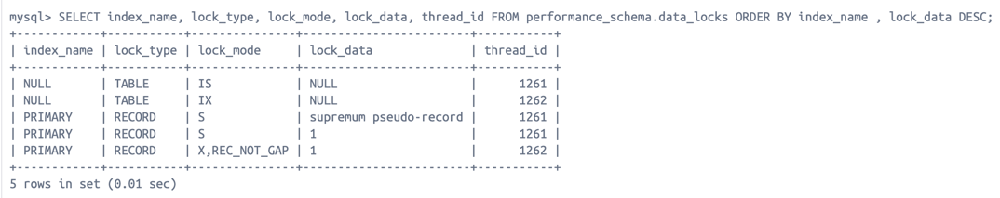

"# database-index-isolation-test-spring-boot" 


## Lock query

```sql
SELECT index_name, lock_type, lock_mode, lock_data, thread_id
FROM performance_schema.data_locks
ORDER BY index_name, lock_data DESC;
```


